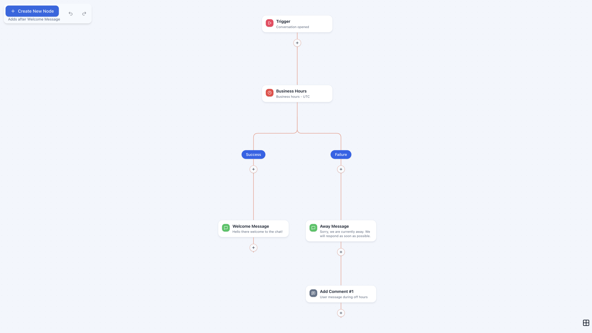

# Rocketbots Flow Builder Assessment

A Vue 3 flow-chart editor for the Rocketbots/respond.io assessment payload. It supports local editing, persistence, validation, keyboard navigation, and undo/redo for moves, edits, creates, and deletes.

## Live preview

[rocketbots-assessment.vercel.app](https://rocketbots-assessment.vercel.app)



## Requirements

- [x] Load the supplied payload and render the connected flow
- [x] Create a message, comment, or business-hours step, and show where it will be inserted
- [x] Edit step content with inline validation
- [x] Delete a step and reconnect the branch beneath it
- [x] Persist edits in the browser and restore them on reload
- [x] Undo and redo moves, edits, creates, and deletes
- [x] Move between steps with the keyboard and open a shareable details route
- [x] Reflow only the edited branch, leaving unrelated positions in place

The reasoning behind these choices is in [docs/design-decisions.md](docs/design-decisions.md).

## Quick start

Requires Node.js 22 and pnpm.

```bash
corepack enable
pnpm install --frozen-lockfile
pnpm dev
```

Open [http://localhost:5173](http://localhost:5173).

## Documentation

- [Quick start](docs/quick-start.md)
- [Architecture](docs/architecture.md)
- [Design decisions](docs/design-decisions.md)
- [Development and quality](docs/development.md)
- [Contributions and releases](docs/development.md#contributions-versioning-and-releases)
- API reference: run `pnpm docs:build`, then open `docs/api/index.html`
