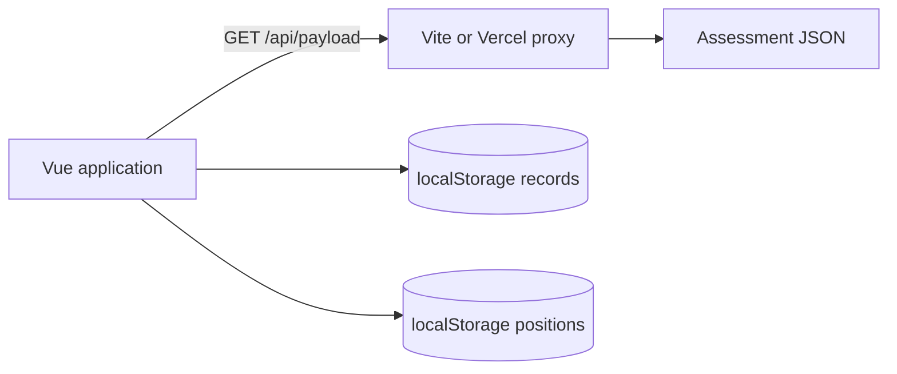
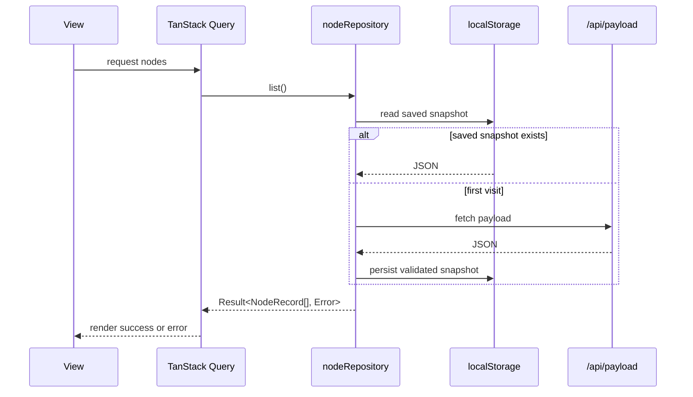

# Architecture

## System context

The application is a Vue 3 single-page flow editor. The initial graph comes from a read-only remote JSON payload through a same-origin proxy. All subsequent edits remain in browser storage; there is no application backend or upload API.

## Source boundaries

| Path                        | Responsibility                                                                                              |
| --------------------------- | ----------------------------------------------------------------------------------------------------------- |
| `src/features/flow`         | Graph conversion, deterministic layout, Vue Flow rendering, history coordination, and keyboard shortcuts    |
| `src/features/nodes`        | Record contracts, validation, record construction, repository access, and TanStack Query mutations          |
| `src/features/node-details` | URL-driven details sheet and type-specific editors                                                          |
| `src/stores/flowUi.js`      | UI-only state: positions, focus, and bounded undo/redo commands                                             |
| `src/router`                | Root flow route and `/nodes/:nodeId` detail routes                                                          |
| `src/components/ui`         | Reusable presentation primitives                                                                            |
| `tests`                     | Domain unit tests, routed-view integration tests, Cucumber scenarios, Playwright page objects, and fixtures |

Dependencies point inward from Vue components and composables to the graph and validation modules. Browser storage and network access are isolated behind `nodeRepository` except for UI-only position persistence in the Pinia store.

## State ownership

There is one owner for each kind of state:

- TanStack Vue Query owns node records and their loading/error lifecycle.
- Pinia owns canvas positions, focused node ID, and undo/redo command stacks.
- Vue Router owns whether a node detail sheet is open through `/nodes/:nodeId`.
- Component-local state owns unsaved form drafts.

Pinia deliberately does not mirror node records. This avoids cache synchronization paths and makes optimistic updates visible to every consumer through one query key.

## Record data flow

Mutations optimistically replace the cached snapshot, persist the complete record list through the repository, roll back on either a returned error or a rejected mutation, and invalidate the query when settled.

## Graph model

Each record identifies its parent with `parentId`; roots use `-1`. Business Hours records own Success and Failure connector records. Pure functions in `src/features/flow/lib/graph.js` derive Vue Flow nodes, edges, navigation targets, splice operations, deletion rewiring, and deterministic fallback positions.

Canvas positions are separate from domain records. Existing manual positions survive graph edits, while new records receive positions derived from the graph layout.

## Loading and performance

The initial route ships the shell, query/store logic, and loading UI. The Vue Flow canvas loads after its viewport intersects and the browser becomes idle. Node details, node creation, and type-specific editors are action-driven chunks. `pnpm build` enforces initial-route, total JavaScript, largest-chunk, and CSS budgets in raw and gzip bytes.

## Deployment

During development and preview, Vite proxies `/api/payload` to the assessment S3 object. In production, `vercel.json` provides the payload proxy and rewrites history routes to `index.html`. Direct browser access to S3 is intentionally avoided because the source does not expose the required CORS headers.
