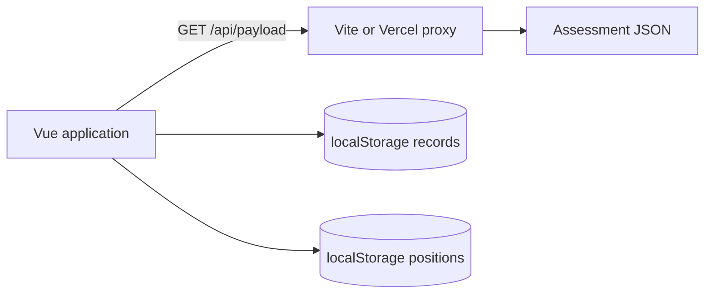
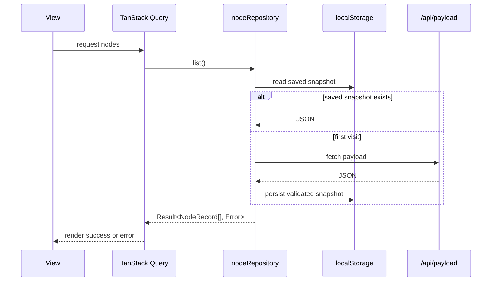

# Architecture

## System context

The application is a client-side Vue 3 flow editor. The initial graph loads from a read-only remote JSON endpoint through a same-origin proxy. All edits persist in browser `localStorage`; there is no custom backend service.

```mermaid
graph LR
  Browser["Vue application"] -->|"GET /api/payload"| Proxy["Vite or Vercel proxy"]
  Proxy --> Payload["Assessment JSON"]
  Browser --> Records[("localStorage records")]
  Browser --> Positions[("localStorage positions")]
```

## Source boundaries

| Path                        | Responsibility                                                                                                  |
| --------------------------- | --------------------------------------------------------------------------------------------------------------- |
| `src/features/flow`         | Graph conversion, deterministic layout, Vue Flow rendering, history composable, branch animation, and shortcuts |
| `src/features/nodes`        | Domain types, Zod schemas, validation, record factories, `nodeRepository`, and TanStack Query mutations         |
| `src/features/node-details` | Route-driven details sheet and node editors (message, comment, business hours)                                  |
| `src/stores/flowUi.js`      | UI state: node positions, focused node ID, and 50-command undo/redo stacks                                      |
| `src/router`                | Flow route (`/`) and node detail route (`/nodes/:nodeId`)                                                       |
| `src/components/ui`         | Reusable presentation primitives                                                                                |
| `tests`                     | Domain unit tests, routed integration tests, Cucumber/Playwright scenarios, and fixtures                        |

Dependencies point inward toward domain records and graph pure functions. Network and storage access are isolated behind `nodeRepository`, while canvas positions live in Pinia.

## State ownership

State has single ownership across the application:

- **TanStack Vue Query** owns node records, query caching, and optimistic mutation lifecycles.
- **Pinia** owns canvas positions, the focused node ID, and the in-memory undo/redo command stacks.
- **Vue Router** owns sheet open/close state via `/nodes/:nodeId`.
- **Component state** owns uncommitted form drafts.

Pinia does not duplicate node records. This avoids cache synchronization bugs and ensures all components read the same optimistic query state.

## Record data flow

```mermaid
sequenceDiagram
  participant View
  participant Query as TanStack Query
  participant Repo as nodeRepository
  participant Storage as localStorage
  participant Remote as /api/payload

  View->>Query: request nodes
  Query->>Repo: list()
  Repo->>Storage: read saved snapshot
  alt saved snapshot exists
    Storage-->>Repo: JSON
  else first visit
    Repo->>Remote: fetch payload
    Remote-->>Repo: JSON
    Repo->>Storage: persist validated snapshot
  end
  Repo-->>Query: Result<NodeRecord[], Error>
  Query-->>View: render success or error
```

Mutations optimistically update the query cache, persist the snapshot through `nodeRepository`, and roll back on error. The repository returns typed `neverthrow` results to make success and failure explicit.

## Graph model and layout

Domain records use `parentId` references (`-1` indicates the trigger node). Business hours nodes own Success and Failure connector records. Pure functions in `src/features/flow/lib/graph.js` derive Vue Flow nodes, edges, keyboard navigation targets, splice insertions, and deletions.

Canvas positions are stored separately from domain records:

- **Insert:** The new node occupies the child's position, and the displaced subtree slides down by 1 row (or 2 rows for business hours).
- **Delete:** The reconnected subtree slides up to close the gap.
- **Independent branches:** Unrelated branches retain their exact coordinates.
- **Branch motion:** Shifts animate over 280ms (`src/features/flow/lib/branchMotion.js`) before settling into persistent positions.

## Loading and performance

The initial bundle loads only the app shell, router, query client, and loading skeleton. The Vue Flow canvas is deferred until its container enters the viewport and the browser is idle. Node details, creation dialogs, and editors are dynamic imports. `pnpm build` validates initial-route, chunk, and CSS size limits via `bundle-budgets.json`.

## Deployment

In development, Vite proxies `/api/payload` to the S3 bucket. In production, `vercel.json` provides the same proxy and rewrites client-side history routes to `index.html`. The proxy avoids browser CORS restrictions on the read-only S3 bucket.
